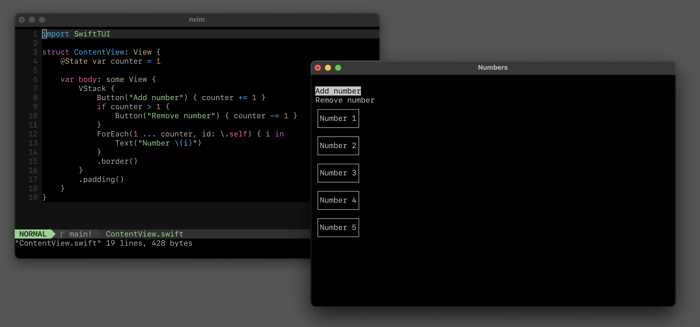

# SwiftTUI


An innovative, exceptionally simple way to build text-based user interfaces.

SwiftTUI brings SwiftUI to the terminal. It provides an API similar to SwiftUI to build terminal applications with a text-based user interface.



### What is working

Many features from SwiftUI are already working:

✓ Property wrappers `@State`, `@Binding`, `@Environment` and `@ObservedObject`<br>
✓ Stacks, `.frame()`, `.padding()`, `GeometryReader`, `@ViewBuilder`, `ForEach`, `Group`<br>
✓ Structural identity like in SwiftUI<br>
✓ Scrollable lists with `ScrollView`<br>
✓ `Button`, `TextField` and moving focus with the arrow keys<br>
✓ `Color` with ANSI, xterm and TrueColor support<br>
✓ `Text` with bold, italic, underscore and strikethrough variants<br>
✓ `.onAppear()`, `.border()`, `.foregroundColor()`, `.backgroundColor`<br>
✓ Modifiers applied to all views in a collection like in SwiftUI

### Getting started

To use SwiftTUI, you need to add the SwiftTUI package dependency. Import SwiftTUI in your files, and write your views like SwiftUI views with the supported features. Then, start the terminal application using one of your views as the root view. This is the simplest SwiftTUI app you can write:

```swift
import SwiftTUI

struct MyTerminalView: View {
  var body: some View {
    Text("Hello, world!")
  }
}

Application(rootView: MyTerminalView()).start()
```

To run your app, change to your package's directory and run it from the terminal:

```
swift run
```

For more, and to see the supported functionality, check out the [documentation](https://rensbreur.github.io/SwiftTUI/documentation/swifttui/).

### Examples

These example projects are included in the repository.

#### ToDoList ([Examples/ToDoList](Examples/ToDoList))


This is a very simple to-do list application. Use the arrow keys to move around. To complete a to-do item, select it, and then press the enter key or space bar. To add a new to-do item, move to the text field, enter a description, and press the enter key to add it to the list. Completed items are automatically removed from the list after half a second.

#### Flags ([Examples/Flags](Examples/Flags))


This is a flag editor, which you will agree to if you come from a country which has a simple flag consisting of colors stacked horizontally or vertically. Select one of the colors of the flag to change it. Use the options on the right to change the number of colors or the flag orientation.

### Showcase

Are you working on a project that's using SwiftTUI? Get in touch with me if you'd like to have it featured here.

#### soundcld


This is a TUI application for SoundCloud. It's not (yet) available publicly.

### More

See a screen recording of SwiftTUI [in action](https://www.reddit.com/r/SwiftUI/comments/wlabyn/im_making_a_version_of_swiftui_for_terminal/) on Reddit.

Learn how [the diffing works](https://rensbr.eu/blog/swiftui-diffing/) on my blog.

### Documentation

You can find generated documentation [here](https://rensbreur.github.io/SwiftTUI/documentation/swifttui/).

### Contributing

This is an open-source project, contributions are welcome! The goal of SwiftTUI is to resemble SwiftUI when it comes to both API and   inner workings, unless those don't make sense for terminal applications. Features that SwiftUI lacks but that would be useful for terminal applications might better live in a seperate project.
