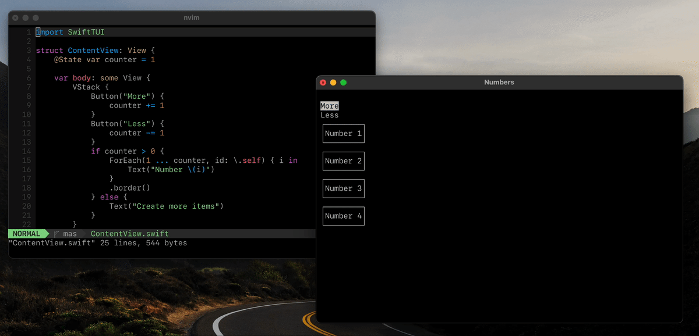

# SwiftTUI

SwiftTUI brings SwiftUI to the terminal. It provides an API similar to SwiftUI to build terminal applications with a text-based user interface.



### What is working

SwiftTUI is still in an experimental phase and might not yet be ready to power the next big terminal app. However, there are many things that are working:

✔︎ Using VStack, HStack, ForEach to build lists
✔︎ Dynamic view content with if statements
✔︎ Structural identity works in the same way as in SwiftUI
✔︎ Button, TextField and moving focus with the arrow keys
✔︎ Modifiers .border() and .padding() are applied to all views in a collection
✔︎ Using `@State` to store values and invalidate views

### Getting started

Add the SwiftTUI package dependency. Import SwiftTUI in your files

```swift
import SwiftTUI
```

Write your terminal views like SwiftUI views.

```swift
struct MyTerminalView: View {
  var body: some View {
    Text("Hello, world!)
  }
}
```

Then, start the terminal application.

```swift
Application(rootView: MyTerminalView()).start()
```

Check out the Examples directory.

